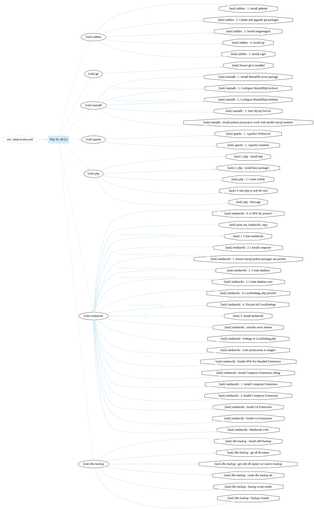

**Repository moved to https://git.tib.eu/confident/confiDent-Ansible-VMs**

---

# confiDent - Ansible VM management playbooks
Fork of [semantic-mediawiki-box](https://github.com/TIBHannover/semantic-mediawiki-box), by [Mirjan Hoffmann](https://github.com/mirjan-hoffmann)

**This project is intended to automate the process of installing and configuring a LAMP server, ready to host Mediawiki instances.**

Currently the Mediawiki installation is disabled.

## Requirements
* Ansible
* Vagrant

## Project Structure

* `mw_lamp/system.yml` the sequence of roles involved in the LAMP server installation
* `mw_lamp/roles/*` tasks, files, templates, handlers for each of the roles
* `playbooks/` assorted playbook with actions such as create user 
* `hosts` ansible inventory file for local VM (default in `ansible.cfg`)
* `hosts_confident` ansible inventory file for confiDent VMs
* `Vagrantfile` vagrant configuration for the creation of the local VM

## Variables' locations:
* <s>MW & MariaDB vars: `mw_lamp/roles/mediawiki/defaults/main.yml`</s>
* <s>MW extensions: `mw_lamp/roles/mediawiki/vars/extensions.yml`</s>
* Usernames and keys (used by `playbooks/addusers.yml`) `playbooks/vars/users.yml`

## Use ansible-vault to hold *secrets*

The vault file passwd.yml holds *secrets* used by the playbook, namely the variables:
* `confident_sudo_pass` used in hosts_confident
* `confident_mariadb_root_pass` used in ansible/roles/mariadb/templates/mysql.confident.cnf
* `default_mariadb_root_pass` used in ansible/roles/mariadb/templates/mysql.cnf
* `confident_wiki_db_pwd` used in ansible/roles/mediawiki/defaults/main.yml
* `confident_wiki_admin_pwd` used in ansible/roles/mediawiki/defaults/main.yml

# Run
## all roles from system.yml on local VM
* bring VM up `vagrant up`
* run system.yml playbook: `ansible-playbook -i hosts mw_lamp/system.yml --ask-vault-pass`

## all roles from system.yml on remote VMs
* run system.yml playbook: `ansible-playbook -i hosts_confident mw_lamp/system.yml --ask-vault-pass`
    * change only in hosts file: `hosts_confident`

## single roles/tag from system.yml 
* `ansible-playbook -i hosts_confident mw_lamp/system.yml --tags utilities --ask-vault-pass`

## run single playbook
* against local VM(s): `ansible-playbook -i hosts playbooks/addusers.yml --ask-vault-pass ` 
* against confident hosts: `ansible-playbook -i hosts_confident playbooks/addusers.yml --ask-vault-pass `

## run single playbook against a single inventory host
`ansible-playbook -i hosts_confident playbooks/utilities_debug/print_info.yml --ask-vault-pass --limit tib.confident.test`

### Create ansible-vault file
* create `ansible-vault create passwd.yml`
* add variable to vaulfile  
    * run `ansible-vault edit passwd.yml`
    * add: `confident_sudo_pass: XYZ`
    * save
* run ansible command with `--ask-vault-pass`:
    * `ansible-playbook playbooks/addusers.yml --ask-vault-pass --extra-vars '@passwd.yml'`
* reset vaul file password: `ansible-vault rekey passwd.yml`

# Individual Playbooks
## Grobid playbook
`ansible-playbook playbooks/grobid/main.yaml -i hosts --ask-vault-pass`

# Playbook graph generation
with [ansible-playbook-grapher](https://github.com/haidaraM/ansible-playbook-grapher)

`ansible-playbook-grapher -i hosts_confident --ask-vault-pass  --include-role-task mw_lamp/system.yml`

